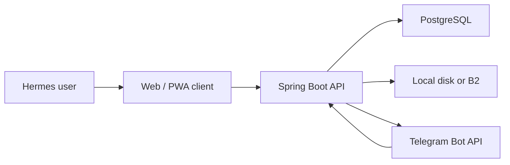
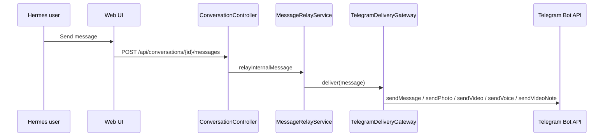
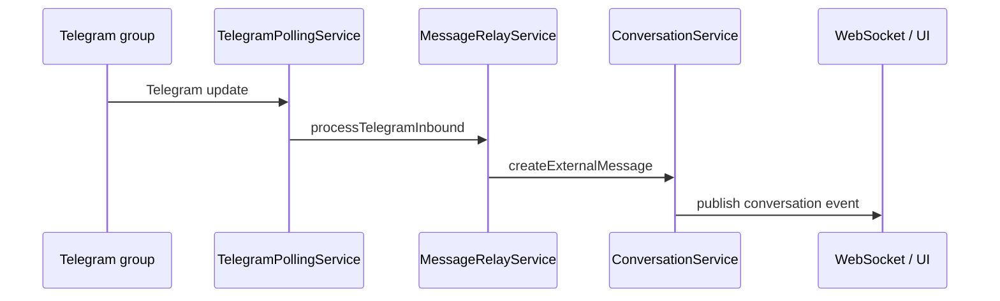

# HermesBridge Architecture

This document explains how HermesBridge works internally.

## High-Level Picture

HermesBridge has three main surfaces:

1. Hermes backend
2. Telegram bot bridge
3. Web/PWA client

## Main Components

### Account Layer

Package:

- [`src/main/java/com/vladislav/tgclone/account`](../src/main/java/com/vladislav/tgclone/account)

Responsibilities:

- user accounts
- Telegram identity binding
- bearer token creation and validation
- token persistence

Important classes:

- `UserAccount`
- `TelegramIdentity`
- `ApiToken`
- `TelegramRegistrationService`
- `ApiTokenService`

### Conversation Layer

Package:

- [`src/main/java/com/vladislav/tgclone/conversation`](../src/main/java/com/vladislav/tgclone/conversation)

Responsibilities:

- internal chats
- memberships and roles
- invites
- messages
- attachments
- replies
- mention normalization

Important classes:

- `Conversation`
- `ConversationMember`
- `ConversationInvite`
- `ConversationMessage`
- `ConversationAttachment`
- `ConversationService`
- `ConversationMentionService`

### Bridge Layer

Package:

- [`src/main/java/com/vladislav/tgclone/bridge`](../src/main/java/com/vladislav/tgclone/bridge)

Responsibilities:

- binding internal conversations to external transports
- relay and deduplication
- delivery records
- outbound delivery to Telegram

Important classes:

- `TransportBinding`
- `MessageRelayService`
- `DeliveryRecord`
- `TelegramDeliveryGateway`

### Telegram Layer

Package:

- [`src/main/java/com/vladislav/tgclone/telegram`](../src/main/java/com/vladislav/tgclone/telegram)

Responsibilities:

- long polling
- Telegram command UX
- inline buttons
- callback handling
- low-level Bot API requests

Important classes:

- `TelegramPollingService`
- `TelegramBotClient`
- `TelegramPrivateDialogStateService`

### Media Layer

Package:

- [`src/main/java/com/vladislav/tgclone/media`](../src/main/java/com/vladislav/tgclone/media)

Responsibilities:

- persistent media storage
- materializing stored files to temporary local files
- local disk provider
- S3-compatible provider configuration

Important classes:

- `MediaStorageService`
- `MediaProperties`

### Security Layer

Package:

- [`src/main/java/com/vladislav/tgclone/security`](../src/main/java/com/vladislav/tgclone/security)

Responsibilities:

- bearer token filter
- current authenticated user
- auth/profile API

Important classes:

- `BearerTokenAuthenticationFilter`
- `SecurityConfig`
- `AuthController`

## Data Model

Core entities:

- `user_account`
- `telegram_identity`
- `api_token`
- `conversation`
- `conversation_member`
- `conversation_invite`
- `conversation_message`
- `conversation_attachment`
- `transport_binding`
- `delivery_record`
- `sync_cursor`

The schema evolves through Flyway migrations in:

- [`src/main/resources/db/migration`](../src/main/resources/db/migration)

## Message Flow

### Hermes -> Telegram

Flow details:

- message is stored first
- UI gets the stored version
- relay fans out to active external bindings
- delivery result is stored in `delivery_record`

### Telegram -> Hermes

Flow details:

- bot receives update through long polling
- relay resolves active `TransportBinding`
- inbound message is deduplicated
- author is mapped to a Hermes account if Telegram identity is known
- reply target is resolved if possible
- message becomes a normal Hermes conversation message

## Deduplication

Deduplication is based on transport-level source identifiers:

- source transport
- source chat id
- source message id

This prevents duplicate creation when the same Telegram update appears more than once.

## Delivery Records

`delivery_record` maps:

- internal Hermes message id
- target transport
- target chat id
- target message id

This is important for:

- outbound reply resolution
- tracking what external message a Hermes message became

## Replies

Hermes supports replies both ways:

- Telegram reply -> Hermes reply target
- Hermes reply -> Telegram reply target

When exact external mapping exists, Telegram replies point to the correct original external message.

## Mentions

Mentions are normalized through `ConversationMentionService`.

The system handles:

- Hermes-side `@username`
- conversion to Telegram usernames where possible
- normalization of inbound Telegram mentions into Hermes-friendly text

## Media Model

Attachment kinds:

- `PHOTO`
- `VIDEO`
- `VIDEO_NOTE`
- `VOICE`
- `DOCUMENT`

For each attachment Hermes stores:

- original filename
- MIME type
- storage key
- size
- kind

The actual binary can live:

- on local disk
- in Backblaze B2 / S3-compatible storage

## Telegram Media Delivery

Outbound Telegram media methods:

- `sendPhoto`
- `sendVideo`
- `sendVoice`
- `sendVideoNote`
- `sendDocument`
- `sendMediaGroup`

Special behavior:

- media groups are sent when a compatible attachment batch is present
- Hermes video notes are delivered to Telegram as real `video_note` when possible
- for Hermes-originated video notes, a short context message is sent first so Telegram users can see who sent it

## Web Client / PWA

The frontend is a static client in:

- [`src/main/resources/static/index.html`](../src/main/resources/static/index.html)
- [`src/main/resources/static/app.js`](../src/main/resources/static/app.js)
- [`src/main/resources/static/app.css`](../src/main/resources/static/app.css)

It handles:

- token-based login
- chat list
- messages and reply actions
- media preview
- mention suggestions
- voice recording
- video-note recording
- mobile PWA behavior

PWA assets:

- [`src/main/resources/static/manifest.webmanifest`](../src/main/resources/static/manifest.webmanifest)
- [`src/main/resources/static/sw.js`](../src/main/resources/static/sw.js)

## Why HTTPS Matters

Browser APIs for:

- microphone
- camera
- video-note recording

require a secure context in real environments.

That means:

- `https://...` works
- `http://localhost` works
- `http://SERVER_IP` does not work for camera/mic recording in normal mobile/desktop browsers

## Runtime Profiles

Defaults are defined in:

- [`src/main/resources/application.yml`](../src/main/resources/application.yml)

Production overrides are in:

- [`src/main/resources/application-prod.yml`](../src/main/resources/application-prod.yml)

## Current Operational Model

Today HermesBridge is designed for small self-hosted deployments:

- one Spring Boot instance
- one PostgreSQL database
- one Telegram polling process
- one static web frontend served by the backend

That is enough for private communities and closed groups.

## What Can Be Improved Later

Future directions:

- domain-based HTTPS with reverse proxy
- richer notifications
- separate managed media CDN
- editing and deleting sync
- reactions
- message search
- multi-instance delivery coordination
- local Telegram Bot API server for larger media limits
